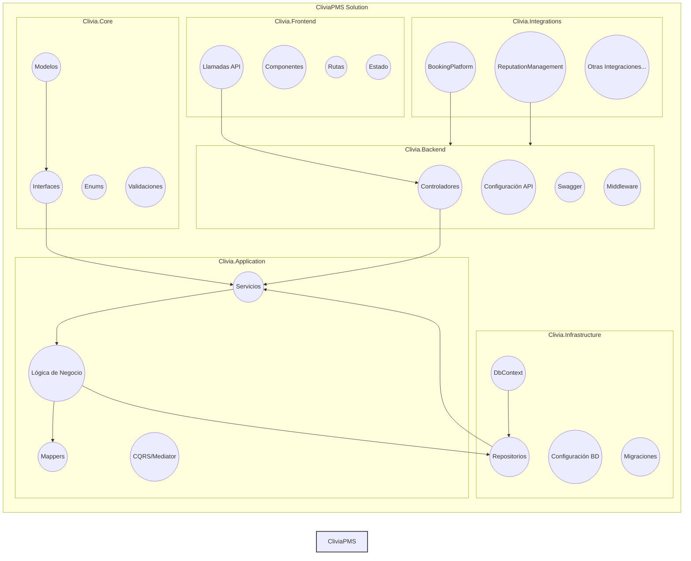
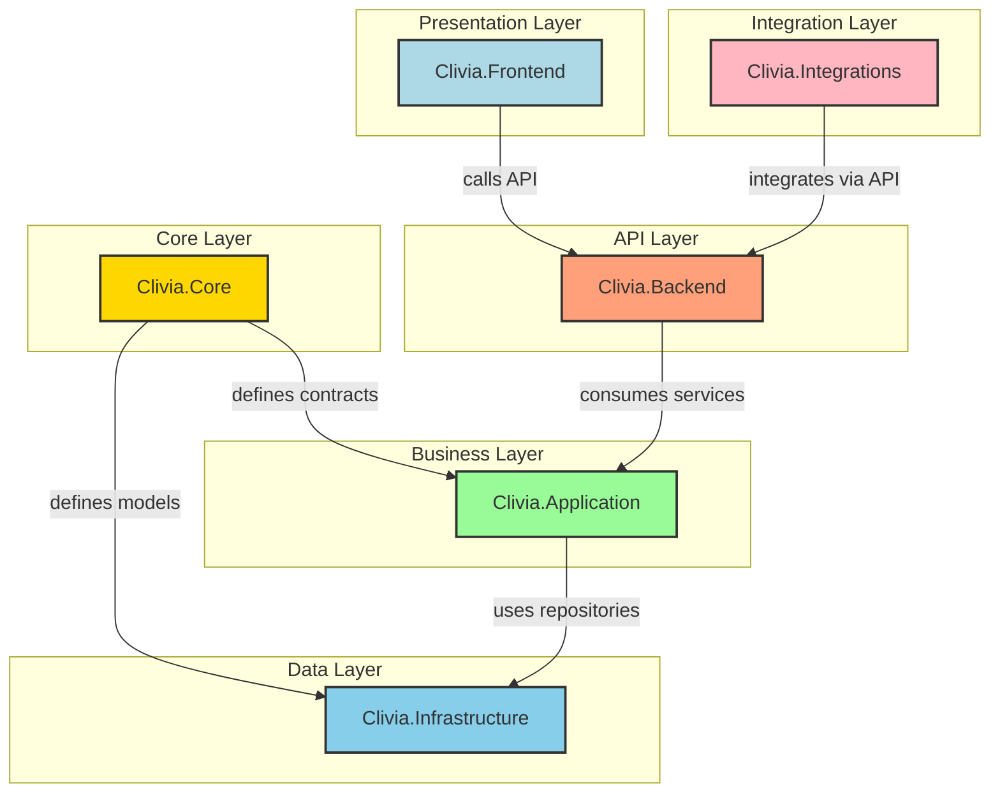

# CliviaPMS - Property Management System

## Descripción

CliviaPMS es un sistema de gestión de propiedades (PMS) diseñado para el hotel "Clivia".  La aplicación facilita la gestión de reservas, la facturación, la gestión de tareas, la supervisión, la gestión de asistencia, la distribución y la gestión de comentarios, con el objetivo de optimizar las operaciones del hotel y mejorar la experiencia del cliente.

## Características Principales

*   **Gestión de Reservas:**
    *   Control de la disponibilidad de habitaciones.
    *   Procesamiento de check-ins y check-outs.
    *   Gestión de tarifas y promociones.
*   **Facturación:**
    *   Generación de facturas.
    *   Gestión de pagos.
    *   Informes de ingresos.
*   **Gestión de Tareas:**
    *   Asignación y seguimiento de tareas.
    *   Gestión de checklists.
*   **Supervisión:**
    *   Checklists de supervisión en diferentes áreas del hotel (mantenimiento, limpieza, restaurantes, cocinas, etc.).
*   **Gestión de Asistencia:**
    *   Control de la asistencia de los empleados.
    *   Gestión de horarios.
*   **Distribución (Integración con OTAs):**
    *   Integración con plataformas de reservas como Booking.com, Hostelworld y Airbnb (a través de un Channel Manager).
*   **Gestión de Comentarios:**
    *   Análisis de comentarios de los clientes (integración con soluciones de IA).
*   **Digital Concierge:**
    *   Permite a los huéspedes solicitar servicios (room service, reservas de restaurantes, etc.) a través de una aplicación móvil o web.

## Arquitectura

La aplicación sigue una arquitectura modularizada con las siguientes capas:

*   **Core:**  Contiene los modelos de datos (DTOs/Entities), interfaces de servicios, enumeraciones y validaciones compartidas por toda la aplicación.
*   **Infrastructure:** Gestiona el acceso a la base de datos PostgreSQL (con Entity Framework Core). Contiene el `DbContext`, las implementaciones de los repositorios y la configuración de la base de datos.
*   **Application:** Contiene la lógica de negocio principal. Implementa los servicios definidos en `Core` y orquesta las operaciones entre los repositorios (de `Infrastructure`).
*   **Backend:** Expose la API RESTful para el `Frontend` (construida con ASP.NET Core).
*   **Frontend:** Proporciona la interfaz de usuario para interactuar con el PMS (construida con React.js o Vue.js).
*   **Integrations:** Contiene soluciones satelitales que se conectan al PMS (ej: integración con plataformas de reservas, gestión de comentarios).

## Tecnologías Utilizadas

*   **Backend:** C# con .NET 8 (ASP.NET Core)
*   **Base de Datos:** PostgreSQL
*   **ORM:** Entity Framework Core
*   **API RESTful:** ASP.NET Core Web API
*   **Documentación API:** Swagger/OpenAPI
*   **Frontend:** React.js o Vue.js
*   **Channel Manager (Opcional):**  [Nombre del Channel Manager] (si se utiliza)

## Estructura de la Solución


## Configuración

1.  **Clona el repositorio:**

    ```bash
    git clone [URL del repositorio]
    ```

2.  **Configura la base de datos:**

    *   Crea una base de datos PostgreSQL llamada `CliviaDB`.
    *   Actualiza la cadena de conexión en el archivo `appsettings.json` del proyecto `Clivia.Backend` con los detalles de tu base de datos:

        ```json
        {
          "ConnectionStrings": {
            "CliviaDBConnection": "Host=[Host];Database=CliviaDB;Username=[Usuario];Password=[Contraseña]"
          }
        }
        ```

3.  **Aplica las migraciones de Entity Framework Core:**

    ```bash
    # Navega al directorio del proyecto Clivia.Backend
    cd Clivia.Backend

    # Ejecuta las migraciones
    dotnet ef database update
    ```

4.  **Configura el Frontend:**

    *   Navega al directorio del proyecto `Clivia.Frontend`.
    *   Instala las dependencias:

        ```bash
        npm install  # o yarn install
        ```

    *   Configura la URL de la API del Backend en el archivo de configuración del Frontend (ej: `.env` o `config.js`).

## Ejecución

1.  **Backend (API):**

    *   Navega al directorio del proyecto `Clivia.Backend`.
    *   Ejecuta la aplicación:

        ```bash
        dotnet run
        ```

    *   La API estará disponible en `https://localhost:[puerto]` (el puerto se define en `launchSettings.json`).
    *   Accede a la documentación de Swagger en `https://localhost:[puerto]/swagger`.

2.  **Frontend:**

    *   Navega al directorio del proyecto `Clivia.Frontend`.
    *   Ejecuta la aplicación:

        ```bash
        npm start  # o yarn start
        ```

    *   La aplicación estará disponible en `http://localhost:[puerto]` (normalmente 3000).

## Pruebas Unitarias

1.  **Ejecuta las pruebas unitarias:**

    ```bash
    # Navega al directorio del proyecto Clivia.Application.Tests (o Clivia.Core.Tests, etc.)
    cd Clivia.Application.Tests

    # Ejecuta las pruebas
    dotnet test
    ```

## Contribución

Si deseas contribuir al proyecto, sigue estos pasos:

1.  Haz un fork del repositorio.
2.  Crea una rama con tu funcionalidad: `git checkout -b feature/mi-funcionalidad`.
3.  Realiza tus cambios y comitea: `git commit -m "Añade mi funcionalidad"`.
4.  Sube los cambios a tu fork: `git push origin feature/mi-funcionalidad`.
5.  Crea un pull request.

## Licencia

[Define la licencia (ej: MIT License)]

## Contacto

Néstor Arias
cliviashostelsalta@gmail.com


## Arquitectura del Sistema

Aquí puedes ver un diagrama de la arquitectura de Clivia PMS:

